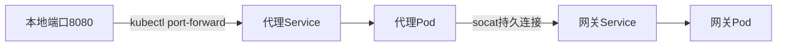
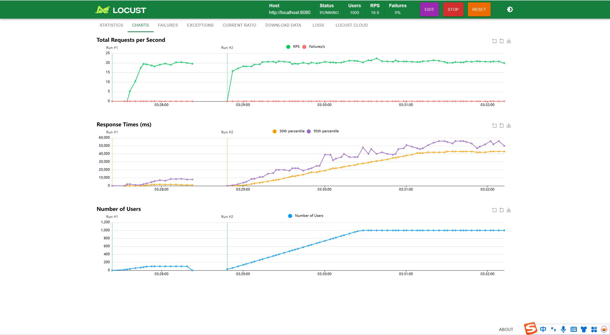
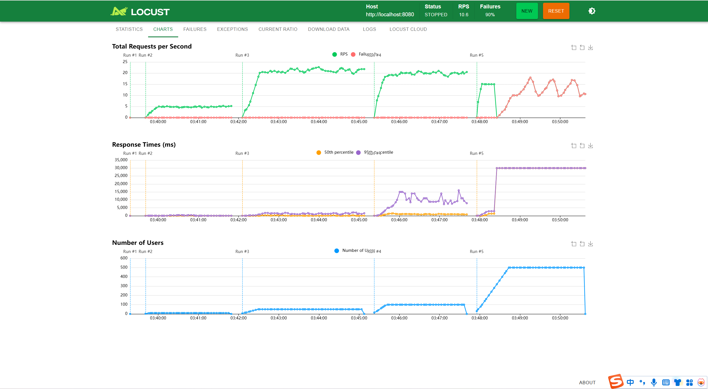
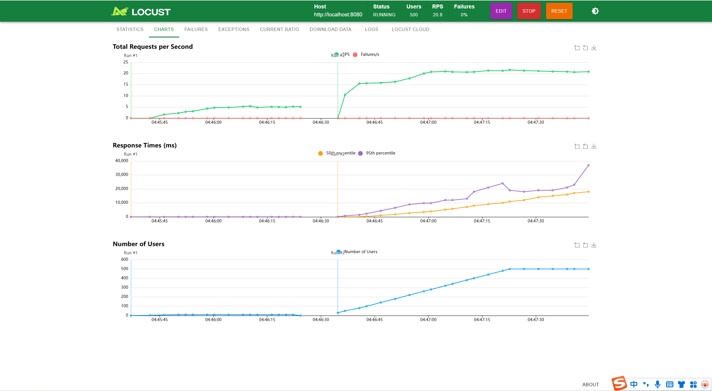

# HPA报告

**启动指令**：  

```cmd
minikube start --driver=docker
kubectl apply -f ./k8s/middle-ware/
kubectl apply -f ./k8s/microservices/
kubectl apply -f ./k8s/hpa.yaml
```  

在一个终端：  

```cmd
kubectl port-forward service/ocean-nacos 8848:8848
```

在另一个终端：

``` cmd  
cd ./k8s/port_forward/
./start-port-forward.bat
```

**其他可能会用到的指令**：
1.撤销部署HPA： 

```cmd
kubectl delete hpa ocean-collection-hpa
kubectl delete hpa ocean-comment-hpa
kubectl delete hpa ocean-docs-hpa
kubectl delete hpa ocean-gateway-hpa
kubectl delete hpa ocean-note-hpa
kubectl delete hpa ocean-notify-hpa
kubectl delete hpa ocean-user-behavior-hpa
kubectl delete hpa ocean-user-hpa
```  

2.安装部署Metrics Server
```cmd

kubectl apply -f https://github.com/kubernetes-sigs/metrics-server/releases/latest/download/components.yaml
```

## HPA具体实现
### 给每个容器设限

```yaml
        resources:
            requests:
              cpu: "150m"   
              memory: "256Mi" 
            limits:
              cpu: "600m"  
              memory: "512Mi" 

```

### 创建 HPA 资源清单

#### **全局配置**
- **副本范围**：全部服务 `minReplicas:1`，`maxReplicas:5`
- **基础资源目标**：多数服务 CPU 70-80%，内存 80-85%

---

#### **关键服务特调策略**
| 服务名称               | CPU目标 | 内存目标 | 扩缩容特性                             |
|------------------------|---------|----------|----------------------------------------|
| **ocean-gateway**      | 50%     | 70%      | 🔺 扩容敏感：每10秒+2副本<br>🔻 缩容保守：600秒冷却 |
| **ocean-comment**      | 75%     | 85%      | 🔻 缩容延迟：300秒冷却                  |
| **ocean-notify**       | 80%     | 85%      | 高负载容忍                             |
| **ocean-user**         | 75%     | 85%      | 无行为特调                             |
#### **特殊行为配置**
1. **ocean-collection**  
   - 缩容：5分钟冷却 + 每分钟最多缩10%副本
   - 扩容：每15秒+1副本（无延迟）

2. **ocean-gateway**  
   - 副本扩容速度加倍（每次+2副本）
   - 最长缩容保护（10分钟冷却）

---

具体代码实现以gateway为例：

```yaml
apiVersion: autoscaling/v2
kind: HorizontalPodAutoscaler
metadata:
  name: ocean-gateway-hpa
spec:
  scaleTargetRef:
    apiVersion: apps/v1
    kind: Deployment
    name: ocean-gateway
  minReplicas: 1
  maxReplicas: 5 # 增加到5个副本
  metrics:
  - type: Resource
    resource:
      name: cpu
      target:
        type: Utilization
        averageUtilization: 50 # 降低阈值，网关应更敏感
  - type: Resource
    resource:
      name: memory
      target:
        type: Utilization
        averageUtilization: 70
  behavior:
    scaleUp:
      stabilizationWindowSeconds: 0 # 立即扩容
      policies:
      - type: Pods
        value: 2 # 每次增加2个副本
        periodSeconds: 10
    scaleDown:
      stabilizationWindowSeconds: 600
      policies:
      - type: Pods
        value: 1
        periodSeconds: 180
```

## 遇到的问题及解决
**问题**：自动扩缩容（HPA）触发后，当Pod被重新创建或替换时，`kubectl port-forward` 会话会丢失与旧Pod的连接，导致转发中断
**解决**：创建持久端口转发代理服务
### 1. 实现原理

### 2. 实施步骤
**步骤1：创建代理部署文件** (`port-forward-proxy.yaml`)
```yaml
apiVersion: apps/v1
kind: Deployment
metadata:
  name: port-forward-proxy
spec:
  replicas: 1
  template:
    spec:
      containers:
      - name: proxy
        image: alpine/socat
        command: ["sh", "-c"]
        args:
          - "while true; do
             socat TCP-LISTEN:8080,fork,reuseaddr TCP:ocean-gateway.default.svc.cluster.local:8080;
             sleep 1;
             done"
---
apiVersion: v1
kind: Service
metadata:
  name: port-forward-proxy
spec:
  selector:
    app: port-forward-proxy
  ports:
    - port: 8080
      targetPort: 8080
```

**步骤2：创建启动脚本** (`start-port-forward.sh`)
```bash
#!/bin/bash
kubectl apply -f port-forward-proxy.yaml
kubectl wait --for=condition=ready pod -l app=port-forward-proxy --timeout=60s
kubectl port-forward service/port-forward-proxy 8080:8080
```

**步骤3：执行脚本**
```bash
chmod +x start-port-forward.sh
./start-port-forward.sh
```


## 压力测试结果
无限制下的结果：



加了限制后的结果：



由上图可知，user数量到300左右时微服务开始崩溃

部署HPA后的结果：



由上图可知，user数量到达500后仍能长时间稳定运行


自动扩缩容后pod的cpu和内存使用情况如上图